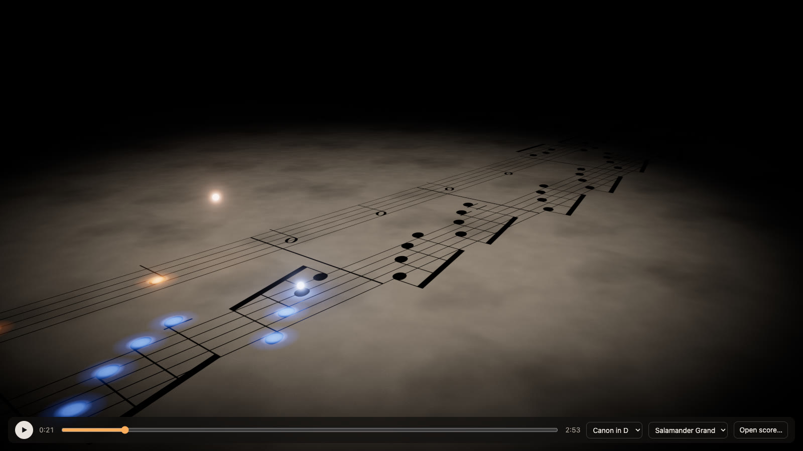

# Glowy Notes



A browser score follower: sheet music lies on a lit page in 3D, one glowing ball per voice hops from note to note, and each note lights up exactly as it sounds. The audio clock drives everything, and the camera glides along with the music.

- **Engraving:** [Verovio](https://www.verovio.org) renders MusicXML to one long system; notes are measured and mapped onto the 3D page.
- **Audio:** in-browser piano (Tone.js), or a pre-rendered humanised performance (Salamander Grand via FluidSynth) played with an exact score-to-audio time map, so the visuals always match what you hear.
- **Controls:** space plays/pauses, ←/→ seek 5 s, Home restarts. Drag to orbit, scroll to zoom, double-click to reset the view. Open or drop your own `.musicxml`/`.mxl`.

## Build

Requires Node 20+.

```bash
npm install
npm run build        # static site in dist/
```

Optional, for rendered audio (`npm run render -- <score-id>`):

- [FluidSynth](https://www.fluidsynth.org) and ffmpeg: `brew install fluid-synth ffmpeg`
- The [Salamander Grand Piano](https://freepats.zenvoid.org/Piano/acoustic-grand-piano.html) SF2, unpacked into `vendor/salamander/`

The score-to-recording aligner (`scripts/align.py`) needs Python: `python3 -m venv .venv && .venv/bin/pip install -r scripts/requirements.txt`.

## Run

```bash
npm run dev
```

Open the URL it prints. Add `?score=minuet-in-g` to pick a score, or `?t=30` to start at 30 s.

Bundled scores are generated with `npm run score`. To render a performance of one:

```bash
npm run render -- canon-in-d
```

The output (`public/media/`) is picked up automatically and offered in the sound switch.

## Credits

- [Verovio](https://www.verovio.org) (LGPL-3.0), [three.js](https://threejs.org) (MIT), [Tone.js](https://tonejs.github.io) and [@tonejs/midi](https://github.com/Tonejs/Midi) (MIT)
- Salamander Grand Piano by Alexander Holm, [CC BY 3.0](https://creativecommons.org/licenses/by/3.0/): used for the in-browser piano samples and for rendered audio
- [FluidSynth](https://www.fluidsynth.org) (LGPL-2.1) and [librosa](https://librosa.org) (ISC) for the offline tools
- Music: Pachelbel's Canon in D and the Minuet in G (after Petzold, BWV Anh. 114) are public domain; the bundled piano arrangements are generated by `scripts/make-test-score.mjs`
